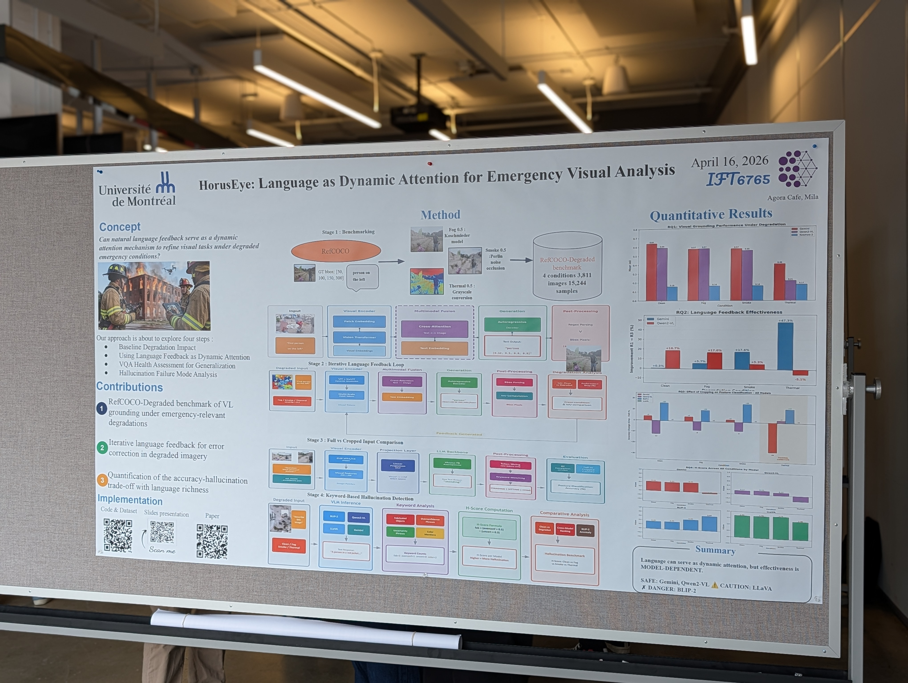

# HorusEye: A Real-Time Conversational Agent for Closed-Loop Emergency Rescue with Calibrated Perception under Degraded Visibility

[](https://arxiv.org/abs/2606.14741)
[](https://www.kaggle.com/datasets/armelyara/refcoco-degraded)
[](https://creativecommons.org/licenses/by/4.0/)
[](https://www.python.org/)

<p align="center">
  
</p>

HorusEye is a dialogue-driven agent embedded in a rescue drone. Rather than producing a single report, it runs a continuous loop with responders — understanding the scene, locating victims, assessing their state on demand, planning extraction under human constraints, and continuously monitoring both the emergency **and the responders' own safety** ("I'll keep an eye on you").

The system is organized as functions **Q1–Q5 + F6**, chained by dialogue. We follow a **measure-before-build** method: each function is benchmarked with existing models first; fine-tuning is only spent on the empirically weakest link.

**Paper**: [arXiv:2606.14741](https://arxiv.org/abs/2606.14741) — Armel Yara, IFT6765, Mila / Université de Montréal

📎 **Slides**: [Google Slides Presentation](https://docs.google.com/presentation/d/19xKly7EtyxvV5UXuAUsE_jN86wQEsfsp/edit?usp=sharing&ouid=106043540914542772736&rtpof=true&sd=true)

<p align="center">
  
</p>

---

## ⚠️ Naming: repo `RSQ*` folders vs system `Q*` functions

Two different numbering schemes live here — do not confuse them:

| In this repo | Meaning |
|---|---|
| `RSQ1_… RSQ4_…` folders | The **four research Sub-questions of the published Q2 paper** (visual grounding, language feedback, health VQA, hallucination). |
| **Q1, Q2, … Q5, F6** | The **HorusEye system functions** (scene understanding, medical assessment, planning, timing, coordination, safety monitoring). |

The paper's `RSQ1–RSQ4` all belong to the HorusEye function **Q2** (medical/perception brick). The new **Q1** work (scene understanding) is a *separate* function, added in its own folder.

---

## HorusEye functions

| Function | What it does | Status |
|---|---|---|
| **Q1** | Scene understanding under degraded visibility — level 1: emergency-type classification + **calibrated uncertainty**; level 2: danger + victim localization | 🟡 level 1 benchmarked (this repo) |
| **Q2** | On-demand medical assessment (language as dynamic attention) | ✅ **published** — arXiv:2606.14741 |
| **Q3** | Constraint-aware tactical planning ("the baby is priority") | ⚪ planned |
| **Q4** | Action-window prediction ("3 minutes") | ⚪ planned |
| **Q5** | Multi-party coordination (field ↔ HQ) | ⚪ planned |
| **F6** | Real-time monitoring + **rescuer safety** (cross-cutting) | ⚪ planned |

---

## Published brick — Q2 (`RSQ1_…`–`RSQ4_…`)

*Language as Dynamic Attention for Emergency Visual Analysis* — does natural-language feedback act as a dynamic attention mechanism for VLMs under degraded emergency conditions?

- **Benchmark:** RefCOCO-Degraded — 15,244 images (3,811 base × clean/fog/smoke/thermal). See `refcoco_degraded_benchmark/` and `download_refcoco.sh`.
- **Models:** Gemini 2.0 Flash, Qwen2-VL-2B, BLIP-2, LLaVA-1.6, Kosmos-2.
- **Key results:** language feedback is **model-dependent** (Gemini +47.3% under thermal via 3-round feedback; Qwen2-VL −5.1% under the same protocol); the **"Thermal Paradox"** (cropping helps RGB, harms thermal); **BLIP-2 hallucinates more under degradation** (H-Score +0.69) → unsafe to deploy.
- **Folders:** `RSQ1_visual_grounding/`, `RSQ2_language_feedback/`, `RSQ3_health_vqa/`, `RSQ4_hallucination/`, `results/`, `assets/`.

---

## New brick — Q1 (scene understanding under degraded visibility)

**Level 1 — emergency-type classification with calibrated uncertainty.** Real AIDER images (fire, flood, collapsed_building, traffic_accident, normal). Veils (fog/smoke) are applied **only where physically plausible**; the simulated "thermal" colormap is abandoned (it confused simulated fire with a veil). Model: **Qwen2.5-VL-7B**, free and reproducible.

**Headline finding — the veil flips the *sign* of miscalibration.** Aggregate ECE hides it; the *signed* gap (confidence − accuracy) reveals it:

| Condition | F1 macro | signed gap (all classes) | signed gap (`normal`, matched) |
|:---:|:---:|:---:|:---:|
| clean | 0.976 | −0.046 (under-confident) | −0.004 |
| fog | 0.956 | −0.022 | +0.044 |
| smoke | 0.886 | **+0.042 (over-confident)** | **+0.173** |

Under smoke the model stays confident while accuracy collapses. The effect **survives a class-composition control** (measured on the `normal` class, present in all conditions) and is even sharper there. Operational reading: under degraded visibility, a prediction ≤ 0.8 confidence should trigger human review; ≥ 0.95 is reliable. Emergency false alarms on `normal` scenes double per veil step (8% → 14% → 28%).

Full write-up: [`Q1_scene_understanding/FINDINGS.md`](Q1_scene_understanding/FINDINGS.md). Level 2 (danger + victim localization, real thermal / VTSaR) is next.

---

## Repository layout

```
HorusEye/
├── RSQ1_visual_grounding/        # Q2 paper — research sub-question 1
├── RSQ2_language_feedback/       # Q2 paper — research sub-question 2
├── RSQ3_health_vqa/              # Q2 paper — research sub-question 3
├── RSQ4_hallucination/           # Q2 paper — research sub-question 4
├── refcoco_degraded_benchmark/  # Q2 dataset builder
├── results/                     # Q2 outputs
├── assets/                      # slides, poster, figures
├── Q1_scene_understanding/      # NEW — HorusEye function Q1
│   ├── q1_classification_kaggle.py   # run: classification + calibration (Kaggle T4)
│   ├── q1_calibration.py             # reproduce metrics + figures from raw records
│   ├── FINDINGS.md                   # Q1 calibration write-up
│   └── results/
│       ├── q1_all_records.json       # 550 per-prediction records
│       ├── q1_summary.json
│       ├── q1_reliability_by_condition_EN.png
│       └── q1_signed_gap_EN.png
├── download_refcoco.sh
├── requirements.txt
└── README.md
```

---

## Reproduce the Q1 calibration analysis

```bash
cd Q1_scene_understanding
python q1_calibration.py results/q1_all_records.json
```


---

## RefCOCO-Degraded Benchmark

| Property | Value |
|----------|-------|
| Base images | 3,811 (RefCOCO val split) |
| Conditions | Clean, Fog, Smoke, Thermal |
| Severities | 0.25, 0.5, 0.75, 1.0 |
| Total samples | 15,244 (at severity 0.5) / 49,543 (all severities) |

**Degradation methods:**
- **Fog** — Koschmieder atmospheric scattering model
- **Smoke** — Perlin noise occlusion with variable opacity
- **Thermal** — Grayscale conversion with INFERNO colormap + sensor noise

The dataset is available on [Kaggle](https://www.kaggle.com/datasets/armelyara/refcoco-degraded).

---

## Repository Structure

```
Horus-Eye/
├── RQ1_visual_grounding/             # Stage 1 & 2: Grounding evaluation
│   ├── degradation_pipeline.py       # Generate degraded images from RefCOCO
│   ├── visual_grounding_gemini.py    # Gemini bbox prediction
│   ├── visual_grouding_Qwen2.py      # Qwen2-VL bbox prediction
│   ├── visual_grounding_Kosmos-2.py  # Kosmos-2 bbox prediction
│   ├── evaluate_grounding.py         # IoU computation & analysis
│   ├── generate_severity_study.py    # Severity curve generation
│   └── horus_bench.py                # Benchmark runner
│
├── RQ2_language_feedback/            # Stage 3: Iterative language feedback
│   ├── language_feedback_gemini.py   # Gemini feedback loop
│   └── language_feedback_qwen2.py    # Qwen2-VL feedback loop
│
├── RQ3_health_vqa/                   # Stage 4: Health VQA posture classification
│   ├── build_rq3_person_only.py      # Filter person-only annotations
│   ├── apply_rq3_annotations.py      # Apply posture annotations
│   ├── rq3_health_annotations.json   # Ground truth posture labels
│   ├── health_vqa_blip2.py           # BLIP-2 posture classification
│   ├── health_vqa_llava/             # LLaVA posture classification
│   ├── health_vqa_qwen.py            # Qwen2-VL posture classification
│   └── health_vqa_gemini.py          # Gemini posture classification
│
├── RQ4_hallucination/                # Stage 5: Hallucination detection
│   ├── hallucination_blip2.py        # BLIP-2 hallucination analysis
│   ├── hallucination_llava.py        # LLaVA hallucination analysis
│   └── hallucination_gemini_qwen.py  # Gemini & Qwen2-VL analysis
│
├── refcoco_degraded_benchmark/       # Dataset annotations & results
│   ├── annotations/                  # Annotations JSON files
│   └── results/                      # Experiment result checkpoints
│
├── results/                          # Aggregated grounding results
├── download_refcoco.sh               # RefCOCO download helper
├── requirements.txt                  # Python dependencies
└── README.md
```

---

## Getting Started

### Prerequisites

```bash
# Clone the repository
git clone -b refcoco-degradation-pipeline https://github.com/armelyara/Horus-Eye.git
cd Horus-Eye

# Install dependencies
pip install -r requirements.txt
```

**Additional model-specific dependencies:**

```bash
# For BLIP-2 and LLaVA
pip install transformers torch accelerate

# For Qwen2-VL
pip install transformers qwen-vl-utils

# For Gemini
pip install google-generativeai

# For Kosmos-2
pip install transformers
```

### Step 1: Download RefCOCO

Download the RefCOCO dataset from [lichengunc/refer](https://github.com/lichengunc/refer) and COCO images from [cocodataset.org](https://cocodataset.org/#download):

```bash
# Place files in this structure:
datasets/
├── refcoco/
│   ├── refs(unc).p
│   └── instances.json
└── coco/
    └── train2014/
        ├── COCO_train2014_000000000009.jpg
        └── ...
```

### Step 2: Generate Degraded Images

```bash
cd RQ1_visual_grounding
python degradation_pipeline.py \
    --refcoco_path ../datasets/refcoco \
    --coco_images ../datasets/coco/train2014 \
    --output_dir ../refcoco_degraded_benchmark/images \
    --severities 0.25 0.5 0.75 1.0
```

### Step 3: Run Evaluations

**RQ1 — Visual Grounding:**
```bash
# Gemini
python visual_grounding_gemini.py --api_key YOUR_KEY

# Qwen2-VL
python visual_grouding_Qwen2.py

# Kosmos-2
python visual_grounding_Kosmos-2.py

# Compute IoU scores
python evaluate_grounding.py
```

**RQ2 — Language Feedback:**
```bash
python ../RQ2_language_feedback/language_feedback_gemini.py
python ../RQ2_language_feedback/language_feedback_qwen2.py
```

**RQ3 — Health VQA:**
```bash
cd ../RQ3_health_vqa
python health_vqa_blip2.py
python health_vqa_gemini.py
python health_vqa_qwen.py
```

**RQ4 — Hallucination Detection:**
```bash
cd ../RQ4_hallucination
python hallucination_blip2.py
python hallucination_llava.py
python hallucination_gemini_qwen.py
```

---

## Models Evaluated

| Model | Encoder | Bbox Output | Used In |
|-------|---------|-------------|---------|
| Gemini 2.0 Flash | Proprietary ViT | Text (regex parsed) | RQ1–RQ4 |
| Qwen2-VL-7B | ViT + NaViT | `<box>` tokens | RQ1–RQ4 |
| Kosmos-2 | ViT | `<loc_XXX>` tokens | RQ1–RQ2 |
| BLIP-2 (FlanT5-XL) | Frozen ViT-G + Q-Former | Text only | RQ3–RQ4 |
| LLaVA-1.5-7B | CLIP ViT-L/14 + MLP | Text only | RQ3–RQ4 |

---

## Results Summary

### RQ1: Visual Grounding (Mean IoU)

| Model | Clean | Fog | Smoke | Thermal | Δ |
|-------|-------|-----|-------|---------|---|
| Gemini | 0.64 | 0.57 | 0.57 | 0.40 | -38% |
| Qwen2-VL | 0.59 | 0.58 | 0.55 | 0.21 | -64% |

### RQ2: Language Feedback Recovery (Thermal)

| Model | Before Feedback | After Feedback | Change |
|-------|----------------|----------------|--------|
| Gemini | 0.40 | 0.59 | **+47.3%** |
| Qwen2-VL | 0.21 | 0.20 | **-5.1%** |

### RQ4: Hallucination (H-Score, lower = safer)

| Model | Clean | Thermal | Trend |
|-------|-------|---------|-------|
| Gemini | 1.2 | 0.8 | ↓ Safer |
| BLIP-2 | 2.1 | 3.5 | ↑ **Dangerous** |

---

## H-Score Formula

```
H-Score = fabricated_objects + (overconfidence × 0.5) − (uncertainty × 0.3)
```

Higher H-Score = more hallucination. A model that expresses uncertainty is penalized less than one that fabricates confidently.


---

## Reproduce the Q1 calibration analysis

```bash
cd Q1_scene_understanding
python q1_calibration.py results/q1_all_records.json
```

Prints per-condition accuracy, F1 macro, ECE, AUROC, and the signed gap (global + `normal`-matched), and writes both figures. ECE / AUROC / F1 are implemented from scratch — no sklearn.

---

## Citation

```bibtex
@article{yara2026horuseye,
  title={HorusEye: Language as Dynamic Attention for Emergency Visual Analysis},
  author={Yara, Armel},
  journal={arXiv preprint arXiv:2606.14741},
  year={2026}
}
```

---

## Acknowledgments

The Q2 of the work was conducted as part of a class project for course IFT6765 at Mila / Université de Montréal. The RefCOCO-Degraded benchmark builds upon RefCOCO (Yu et al., 2016) and MS COCO (Lin et al., 2014).

---

## License

Code: [MIT License](LICENSE)
Dataset: [CC BY 4.0](https://creativecommons.org/licenses/by/4.0/) - AIDER images used in Q1 are GNU GPL v3.0 — respect their upstream terms.
